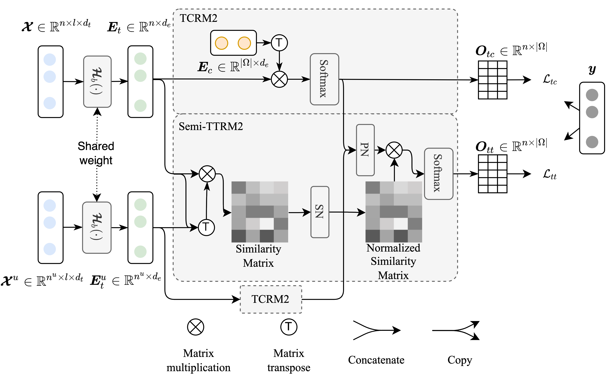

## MRM2: Multi-Relationship Modeling Module for Multivariate Time Series Classification

### Overall of MRM2



### Environment
```shell
conda create -n mrm2 python=3.8
conda activate mrm2
pip3 install torch torchvision torchaudio --extra-index-url https://download.pytorch.org/whl/cu113
pip3 install tsai==0.3.1 fastai==2.5.6  fastcore==1.4.2 pandas==1.4.2 numpy==1.21.6
```

### Down Dataset：
- Down multivariate time series dataset from http://www.timeseriesclassification.com/Downloads/Archives/Multivariate2018_ts.zip
- unzip the dataset, and put it in './data/Multivariate_arff'
- run `python prepare_multivariate_ts.py` to prepare the dataset

### Run the code
- Origin deep model

```shell
# the model_name choice from inceptiontime,fcn,mlstm_fcn,os_cnn, and resnet 
python train_origin.py \
  --data_dir "./data/Multivariate_ts_np" \
  --model_name "inceptiontime" \
  --start_dataset_id 0 \
  --weight_decay 0.01 \
  --lr 0.001 \
  --max_epoch 600 \
  --batch_size 512 \
  --out_dir "./results/origin" 
```

- DM-MRM2

```shell
python train_mrm2.py \
  --data_dir "./data/Multivariate_ts_np" \
  --model_name "inceptiontime" \
  --start_dataset_id 0 \
  --weight_decay 0.01 \
  --lr 0.001 \
  --lr_restart 0.001 \
  --lambda_loss 1.0 \
  --max_epoch 600 \
  --train_from_scratch_max_epoch 400 \
  --batch_size 512 \
  --out_dir "./results/mrm2" 
```

- DM-CL
```shell
python train_cl.py \
  --data_dir "./data/Multivariate_ts_np" \
  --model_name "inceptiontime" \
  --start_dataset_id 0 \
  --weight_decay 0.01 \
  --lr 0.001 \
  --lr_restart 0.001 \
  --lambda_loss 1.0 \
  --max_epoch 600 \
  --train_from_scratch_max_epoch 400 \
  --batch_size 512 \
  --out_dir "./results/cl" 
```


- DM-GAT
```shell
python train_gat.py \
  --data_dir "./data/Multivariate_ts_np" \
  --model_name "inceptiontime" \
  --start_dataset_id 0 \
  --weight_decay 0.01 \
  --lr 0.001 \
  --lr_restart 0.001 \
  --lambda_loss 1.0 \
  --max_epoch 600 \
  --train_from_scratch_max_epoch 400 \
  --batch_size 512 \
  --out_dir "./results/gat" 
```
